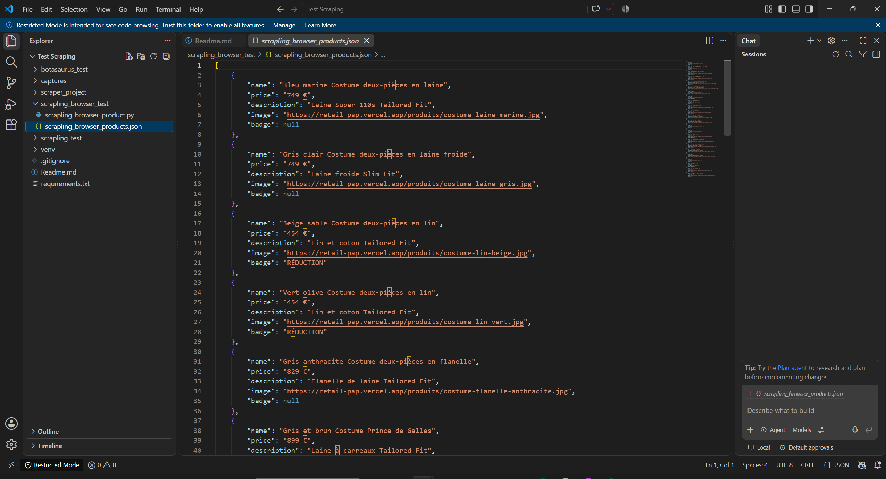
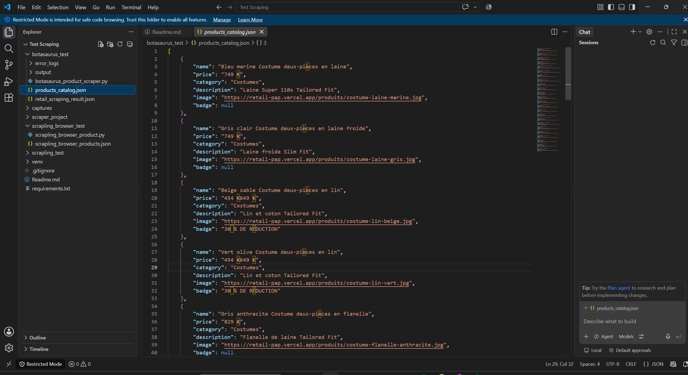

# Compte rendu de benchmark — Comparaison des solutions de Web Scraping

## 1. Objectif du benchmark

[Classement des meilleurs outils de Web Scraping en Python](https://github.com/topics/web-scraping-python)

L'objectif de ce test est de comparer plusieurs solutions modernes de Web Scraping afin d'identifier l'approche la plus adaptée selon le type de site rencontré.

Les solutions étudiées sont :

- **Scrapy** : framework historique orienté crawling et extraction massive.
- **Botasaurus** : framework orienté navigateur automatisé avec capacités anti-détection.
- **Scrapling** : framework récent combinant scraping classique, navigateur dynamique et extraction adaptative.

Le site utilisé pour les tests est :

```
https://retail-pap.vercel.app/
```

Il s'agit d'un site e-commerce moderne dont les produits sont générés côté navigateur avec JavaScript.

Les informations recherchées :

- nom produit
- prix
- description
- image
- badge promotionnel

---

## 2. Installation et prérequis

Avant d'exécuter les tests, il faut créer un environnement virtuel Python et installer les dépendances.

### 2.1 Créer l'environnement virtuel

```bash
python -m venv venv
```

### 2.2 Activer l'environnement virtuel

Sur Windows (PowerShell) :

```bash
venv\Scripts\Activate.ps1
```

Sur macOS / Linux :

```bash
source venv/bin/activate
```

### 2.3 Installer les dépendances

```bash
pip install -r requirements.txt
```

Le fichier `requirements.txt` a été généré avec la commande suivante et regroupe toutes les dépendances nécessaires aux trois frameworks testés (Scrapy, Botasaurus, Scrapling) :

```bash
pip freeze > requirements.txt
```

---

## 3. Présentation des solutions testées

### 3.1 Scrapy

#### Description

Scrapy est un framework Python mature spécialisé dans :

- crawling massif
- exploration de plusieurs pages
- extraction structurée
- pipelines de données

Architecture :

```
Spider
 |
 v
Requête HTTP
 |
 v
HTML serveur
 |
 v
Extraction XPath/CSS
 |
 v
Pipeline
```

#### Avantages

- Très rapide
- Faible consommation mémoire
- Excellent pour les gros volumes
- Très utilisé en production

#### Limites

- N'exécute pas JavaScript par défaut
- Difficulté avec les applications React/Vue/Next.js
- Nécessite Selenium/Playwright pour les pages dynamiques

#### Exécution du test

```bash
cd scraper_project/scraper_project
scrapy crawl retail -o retail_result.json
```

---

### 3.2 Botasaurus

#### Description

Botasaurus est un framework orienté navigateur réel. Il utilise :

- Chromium
- automatisation navigateur
- gestion des sessions
- mécanismes anti-détection

Architecture :

```
Navigateur Chromium
        |
        v
JavaScript exécuté
        |
        v
Page complète
        |
        v
Extraction
```

#### Résultat du test

Sur le site `https://retail-pap.vercel.app/` :

- Page chargée
- Produits détectés
- 24 produits extraits
- Images récupérées
- Prix récupérés

Exemple :

```json
{
  "name": "Bleu marine Costume deux-pièces en laine",
  "price": "749 €",
  "description": "Laine Super 110s Tailored Fit",
  "image": "...jpg"
}
```

#### Avantages

- Très efficace sur les sites modernes
- Gestion JavaScript native
- Bon comportement face aux protections
- Extraction proche d'un utilisateur réel

#### Limites

- Plus lourd qu'un scraper HTTP classique
- Consomme plus de ressources

#### Exécution du test

```bash
cd botasaurus_test
python botasaurus_product_scraper.py
```

---

### 3.3 Scrapling

#### Description

Scrapling est un framework récent proposant plusieurs niveaux de scraping :

- scraping HTTP classique
- navigateur dynamique
- navigateur furtif

Il permet d'adapter la stratégie selon la difficulté du site.

Architecture générale :

```
Scrapling
    |
    +-- Fetcher
    |
    +-- DynamicFetcher
    |
    +-- StealthyFetcher
```

---

## 4. Tests détaillés Scrapling

### 4.1 Scrapling Fetcher

#### Résultat

```
Page récupérée
Titre trouvé
Produits non détectés
```

Cause : les produits sont injectés après exécution JavaScript.

Conclusion : non adapté pour ce site.

#### Exécution du test

```bash
cd scrapling_test
python scrapling_test.py
```

---

### 4.2 Scrapling DynamicFetcher

#### Fonctionnement

Utilisation d'un navigateur Chromium.

#### Résultat

```
Nombre produits trouvés : 24
```

Données extraites :

- Nom
- Prix
- Image
- Description

Conclusion : excellent compromis pour les sites modernes.

---

### 4.3 Scrapling StealthyFetcher

#### Fonctionnement

Même principe que DynamicFetcher mais avec une couche furtive.

#### Résultat

```
Nombre produits trouvés : 24
```

Données extraites :

- Nom
- Prix
- Image
- Description

Conclusion : plus adapté aux sites protégés.

#### Exécution du test

```bash
cd scrapling_browser_test
python scrapling_browser_product.py
```

---

### 4.4 Scrapling DynamicFetcher — version robuste (catalogue avec suivi)

#### Fonctionnement

Version consolidée du test DynamicFetcher, ajoutant un suivi du catalogue entre les exécutions :

- détection des nouveaux produits
- détection des produits orphelins (disparus du site)
- détection des produits modifiés entre deux passages
- journalisation complète dans un fichier de log
- écriture du catalogue dans un fichier `catalogue.json`

#### Résultat

```
Nombre articles trouvés (bruts) : 24
Produits valides extraits : 24

===== RÉSUMÉ =====
Total catalogue : 24
Actifs          : 24
Orphelins       : 0
Modifiés (ce run) : 0
Fichier          : catalogue.json
```

Conclusion : version prête pour un usage répété (suivi de catalogue dans le temps), adaptée à une intégration dans un pipeline de veille produit.

#### Exécution du test

```bash
cd Scrapling_DynamicFetcher
python scrap_catalogue.py
```

Fichiers générés :

- `catalogue.json` : catalogue consolidé des produits
- `scraping.log` : journal détaillé de l'exécution

---

### 4.5 Scrapling DynamicFetcher — Cas d'usage réel : Galeries Bartoux

Au-delà du site de test `retail-pap.vercel.app`, la version robuste du DynamicFetcher a été mise en œuvre sur un cas réel : le site `galeries-bartoux.com`, qui référence des œuvres d'art classées par artiste.

#### Emplacement du script

```
C:\Users\jojo\Documents\projetcts\Professionnelle_fig\Test Scraping\Scrapling_demos_clients\scrapling_bartoux.py
```

#### Structure finale des fichiers et dossiers

Après exécution du script, l'arborescence générée est la suivante :

```
Scrapling_demos_clients\
│
├── scrapling_bartoux.py          ← script principal
├── catalogue.json                ← catalogue complet (toutes les données)
├── scraping_bartoux_final.log    ← logs détaillés
│
├── backups_final\                ← sauvegardes horodatées du catalogue
│   ├── catalogue_20260805_133521.json
│   ├── catalogue_20260805_143015.json
│   └── ...
│
└── artistes\                     ← dossier principal des images
    ├── al-freno\                 ← un sous-dossier par artiste (slugifié)
    │   ├── a-whiter-shade-of-pale.jpg
    │   ├── if-you-could-read-my-mind.jpg
    │   ├── your-love-is-king.jpg
    │   ├── i-only-have-eyes-for-you.jpg
    │   ├── el-paso.jpg
    │   └── lets-go.jpg
    │
    ├── chris-carolina\
    │   ├── white-blouse.jpg
    │   ├── blue-night.jpg
    │   ├── drama-night.jpg
    │   └── ...
    │
    ├── chris-riley\
    │   ├── on-our-way.jpg
    │   ├── fashionably-early.jpg
    │   └── ...
    │
    ├── david-uessem\
    │   ├── radiant-light.jpg
    │   └── ...
    │
    └── (autres artistes...)
```

#### Structure du catalogue.json

```json
{
  "a1b2c3d4e5f6g7h8": {
    "id": "a1b2c3d4e5f6g7h8",
    "source_url": "https://www.galeries-bartoux.com/artistes/al-freno/al-freno_a-whiter-shade-of-pale_150x150cm/",
    "content_hash": "f7e8d9c0b1a2...",
    "first_seen": "2026-08-05T13:36:53.059000+00:00",
    "last_checked": "2026-08-05T13:36:53.059000+00:00",
    "last_changed": "2026-08-05T13:36:53.059000+00:00",
    "status": "active",
    "data": {
      "artist": "AL FRENO",
      "title": "A WHITER SHADE OF PALE",
      "dimensions": "150 x 150 cm",
      "medium": null,
      "year": null,
      "image": "https://www.galeries-bartoux.com/wp-content/uploads/al-freno-a-whiter-shade-of-pale.jpg",
      "local_image": "artistes/al-freno/a-whiter-shade-of-pale.jpg",
      "url": "https://www.galeries-bartoux.com/artistes/al-freno/al-freno_a-whiter-shade-of-pale_150x150cm/",
      "gallery": "Galeries Bartoux",
      "description": "Peinture à l'huile sur toile...",
      "searchable_text": "AL FRENO - A WHITER SHADE OF PALE - 150 x 150 cm"
    },
    "history": []
  }
  // ... autres œuvres
}
```

#### Détail du contenu de chaque dossier

1. **`artistes/`** (dossier principal)
   - Contient un sous-dossier par artiste.
   - Nom des dossiers : slugifiés (ex. `al-freno`, `chris-carolina`).

2. **Sous-dossiers par artiste**
   - Contiennent les images téléchargées.
   - Nom des images : slug du titre + extension `.jpg`.

3. **`backups_final/`**
   - Sauvegarde du catalogue avant chaque mise à jour.
   - Horodatage : `catalogue_AAAAMMJJ_HHMMSS.json`.

4. **`catalogue.json`**
   - Contient toutes les données scrapées.
   - Liens vers les images locales.

#### Conclusion

Ce cas réel confirme, sur un site de production différent du site de test initial, les résultats obtenus avec la version robuste du DynamicFetcher : organisation automatique par artiste, téléchargement des images, suivi des modifications et sauvegardes horodatées, sans intervention manuelle.

---

## 5. Tableau comparatif global

| Critère                     | Scrapy       | Botasaurus             | Scrapling                   |
|------------------------------|--------------|-------------------------|-------------------------------|
| Type                         | HTTP crawler | Navigateur automatisé   | Framework hybride             |
| JavaScript                   | Non natif    | Oui                      | Oui, avec Dynamic/Stealth     |
| Rapidité                     | ⭐⭐⭐⭐⭐        | ⭐⭐⭐                     | ⭐⭐⭐⭐                          |
| Consommation ressources      | Faible       | Élevée                   | Moyenne                       |
| Sites React/Vue/Next         | Limité       | Excellent                | Excellent                     |
| Anti-bot                     | Faible       | Très bon                 | Très bon avec Stealthy        |
| Crawling massif               | Excellent    | Moyen                    | Bon                            |
| Facilité extraction produit  | Moyenne      | Excellente               | Excellente                    |
| Production e-commerce        | Très bon     | Très bon                 | Très bon                      |

---

## 6. Résultats du benchmark sur le site testé

| Solution                  | Résultat                                              |
|----------------------------|--------------------------------------------------------|
| Scrapy                     | HTML récupéré mais nécessite rendu JS supplémentaire  |
| Botasaurus                 | 24 produits extraits avec succès                       |
| Scrapling Fetcher          | Page récupérée mais produits absents                   |
| Scrapling DynamicFetcher   | 24 produits extraits avec succès                       |
| Scrapling StealthyFetcher  | 24 produits extraits avec succès                       |

---

## 7. Conclusion générale

Les tests montrent qu'il n'existe pas un outil universel : le choix dépend du type de site.

### Sites simples et gros volumes

→ **Scrapy**

Meilleur choix pour :

- crawling massif
- catalogues importants
- extraction rapide

### Sites modernes avec JavaScript

→ **Botasaurus ou Scrapling DynamicFetcher**

Meilleur choix pour :

- e-commerce
- React
- Next.js
- pages dynamiques

### Sites protégés

→ **Scrapling StealthyFetcher ou Botasaurus**

Meilleur choix pour :

- Cloudflare
- anti-bot
- fingerprint navigateur

### Conclusion du test réalisé

Sur le site `retail-pap.vercel.app` :

- Scrapy nécessite une couche navigateur supplémentaire.
- Botasaurus récupère directement les produits avec succès.
- Scrapling DynamicFetcher récupère également les produits avec une approche plus légère.
- Scrapling StealthyFetcher apporte une couche supplémentaire pour les sites protégés.

Sur le cas réel `galeries-bartoux.com` (script `scrapling_bartoux.py`), la version robuste du DynamicFetcher a permis une extraction complète et organisée (images classées par artiste, catalogue structuré, sauvegardes automatiques), confirmant sa pertinence pour un déploiement chez un client.

Le meilleur compromis observé pour un projet e-commerce moderne est :

**Scrapling DynamicFetcher / Botasaurus selon le niveau de protection du site.**

<p align="center">
  
  
</p>