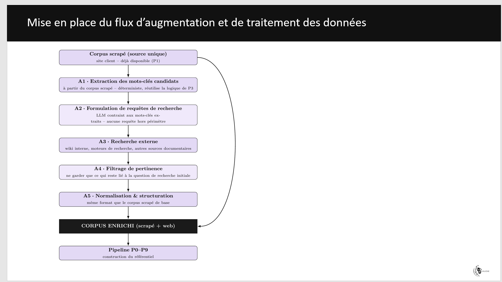

# Flow d'augmentation du corpus - étapes A1 → A3



Projet **séparé** du scraper. Il ne modifie jamais `artistes.json` ni
`catalogue.json` : il les lit seulement, et écrit tout dans `out/`.

Objectif : partir de la source unique (le corpus scrapé Galeries Bartoux)
et aller chercher de la donnée complémentaire sur le net, **avant** de
lancer le pipeline P0–P9 de construction du référentiel.

```
artistes.json + catalogue.json          (produits par le scraper)
        │
        ▼
   A1  extraction des mots-clés candidats      → out/motscles_candidats.json
        │
        ▼
   A2  formulation des requêtes (déterministe) → out/requetes.json
        │
        ▼
   A3  recherche externe Wikipédia + Google    → out/resultats_bruts.json
        │                                        + out/raw/*.json (preuves)
        ▼
   VÉRIF  contrôle d'intégrité (C1 → C6)
```

---

## Installation

```bash
cd data_augmentation_projet
python -m venv venv
venv\Scripts\activate          # Windows
pip install -r requirements.txt
copy .env.example .env          # puis éditer .env
```

Dans `.env`, `SCRAPING_DIR` doit pointer sur le dossier qui contient
`artistes.json` et `catalogue.json`.

---

## Utilisation

```bash
# 1. Extraire les mots-clés candidats
python run.py a1

# 2. Générer les requêtes
python run.py a2

# 3. TEST RÉEL sur 3 requêtes, Wikipédia seulement (pas de clé nécessaire)
python run.py a3 --limite 3 --providers wikipedia

# 4. Contrôler que rien n'a été inventé
python run.py verif

# Tout d'un coup, en mode test
python run.py all --limite 5

# Contrôler la reproductibilité de A1
python run.py a1 --verifier-determinisme
```

Commence toujours par `--limite` et `--providers wikipedia` : Wikipédia
ne demande aucune clé, donc tu peux valider le flow de bout en bout avant
de configurer Google.

---

## Les trois étapes

### A1 — extraction des mots-clés candidats

Seules les données **originales** du corpus sont exploitées — rien qui
soit reconstruit ou dupliqué par le scraper :

| Famille | Provenance | Filtrage |
|---|---|---|
| **structurés (artistes)** | `artistes.name`, `artistes.category` | gardés même vus une seule fois |
| **structurés (catalogue)** | `catalogue.url`, parsée en artiste / titre_oeuvre / dimension | idem, jamais de champ direct (`title`/`artist_name`/`medium` non fiables) |
| **texte libre** | `artistes.bio` | n-grammes 1→3, mots vides retirés, fréquence ≥ `A1_FREQ_MIN` |

`catalogue.url` est la source canonique côté produit : elle porte à la
fois le dossier artiste (`/artistes/<slug>/`) et le slug complet de
l'œuvre, y compris la dimension (`...-120-x-120-cm/`). Les champs
`image` et `local_image` ne sont pas utilisés (le second est parfois
tronqué par le scraper).

Un terme vu dans un champ structuré reste structuré même s'il apparaît
aussi dans la bio — sinon un titre d'œuvre cité dans un texte basculait
en « concept » et se faisait éliminer par le seuil de fréquence.

Chaque terme sort avec son type, sa fréquence, ses variantes d'écriture,
et la **liste des enregistrements et champs d'où il vient**.

### A2 — formulation des requêtes

**Aucun LLM.** Une requête = un gabarit (`A2_TEMPLATES`) + un terme de A1.
Les gabarits sont choisis selon le type du terme, donc on ne pose pas une
question de biographie à une dimension d'œuvre.

Chaque requête garde le `terme_id` et le `template` exact utilisés, donc
elle est reconstructible — et impossible à faire porter sur un sujet
absent du corpus. Les gabarits sont validés au démarrage (un gabarit
sans `{terme}` fait échouer le run plutôt que de produire silencieusement
la même requête pour tous les termes).

### A3 — recherche externe

**Aucun LLM non plus.** Deux fournisseurs, tous deux via API officielle
(pas de scraping des pages de résultats) :

- **Wikipédia** — API MediaWiki publique, sans clé. Actif par défaut.
- **Google** — Programmable Search JSON API, clé + CX requis. Désactivé
  par défaut dans `config.py` tant que la clé n'est pas validée (voir
  *Dépannage Google* ci-dessous). Un fournisseur qui enchaîne
  `A3_ECHECS_FATALS_MAX` échecs 401/403 est automatiquement suspendu
  pour le reste du run, pour ne pas rejouer une erreur de credentials
  sur toutes les requêtes restantes.

Pour chaque appel on conserve : URL appelée (clé masquée), code HTTP,
horodatage UTC, `sha256` du corps de la réponse, et le **corps brut
sauvegardé** dans `out/raw/`.

#### Dépannage Google (403)

Un 403 systématique dès le premier appel, avec une clé renseignée,
vient presque toujours de l'un de ces trois points :
1. la Custom Search API n'est pas activée sur le projet Google Cloud ;
2. la clé est restreinte (HTTP referrer / IP), ce qui bloque un appel
   serveur ;
3. le `GOOGLE_CSE_ID` n'appartient pas au projet de la clé.

Le message d'erreur exact renvoyé par Google est repris dans le log et
dans `provenance.erreur` du résultat — il indique lequel des trois.

---

## Comment on prouve que rien n'est inventé

C'est l'objet de `python run.py verif`. Six contrôles :

| Code | Contrôle |
|---|---|
| **C1** | Le chaînage des empreintes tient : A2 cite bien la version actuelle de A1, A3 celle de A2. Modifier un fichier à la main casse la chaîne. |
| **C2** | Chaque terme de A1 est reproductible depuis le corpus scrapé : recherche directe pour les champs copiés tels quels (`name`, `category`, bio), et **reparsing de l'URL source citée en `origine`** pour les termes reconstruits (artiste/titre_oeuvre/dimension) — une simple sous-chaîne ne suffit pas puisque A1 reformate le texte (tirets retirés, dimension recomposée). |
| **C3** | Chaque requête de A2 est reconstruite depuis `gabarit + terme`. Non reconstructible = texte libre injecté = échec. |
| **C4** | Chaque résultat porte un HTTP 200, et le `sha256` du fichier brut est **recalculé** et comparé. |
| **C5** | Chaque URL/titre restitué est retrouvé **dans la réponse brute du serveur**. |
| **C6** | L'étape de collecte déclare `llm_utilise: false`. |

La commande sort avec le code **0** si tout est conforme, **1** sinon —
donc utilisable telle quelle dans un contrôle automatisé.

Ces contrôles ont été testés en négatif : injecter un résultat fabriqué
fait tomber C5, altérer un fichier brut fait tomber C4, injecter un
terme absent du corpus fait tomber C2.

**À savoir :** C4/C5 prouvent que le contenu vient bien d'une réponse
serveur et qu'il n'a pas été altéré depuis. Ils ne jugent pas la
*qualité* ni la *pertinence* du résultat — c'est le rôle de l'étape A4
(filtrage), non incluse ici.

---

## Réglages

Tout est dans `config.py`, rien n'est codé en dur ailleurs. Les
paramètres qui bougent le plus :

| Paramètre | Effet |
|---|---|
| `A1_CHAMPS_STRUCTURES` | champs directs pris tels quels (`name`, `category` côté artistes). |
| `A1_CHAMP_URL_CATALOGUE` | champ catalogue reparsé pour en tirer artiste/titre/dimension (`url` par défaut). |
| `A1_REGEX_DIMENSION` | motif de détection d'une dimension dans le slug d'URL. |
| `A1_FREQ_MIN` | seuil de fréquence du texte libre. Plus haut = moins de bruit, moins de concepts. |
| `A1_NGRAM_MAX` | longueur max des expressions extraites (3 = « peinture à l'huile »). |
| `A1_STOPWORDS` | mots vides. À enrichir dès que du bruit apparaît dans la sortie. |
| `A2_TEMPLATES` | les gabarits de requêtes, par type de terme. |
| `A2_TYPES_INCLUS` | quels types de termes déclenchent une recherche. |
| `A3_PROVIDERS` | fournisseurs actifs, dans l'ordre. |
| `A3_ECHECS_FATALS_MAX` | échecs 401/403 consécutifs avant suspension d'un fournisseur. |
| `A3_MAX_RESULTATS_PAR_REQUETE` | volume ramené par requête. |
| `A3_DELAI_ENTRE_REQUETES` | politesse réseau. Ne pas descendre trop bas sur Google. |

Les paramètres effectifs de chaque run sont recopiés dans le `meta` du
fichier de sortie et dans `out/manifest.json` : on sait toujours avec
quels réglages un fichier a été produit.

---

## Ce qui n'est pas dans ce projet

Volontairement, d'après le cadrage actuel :

- **A4 filtrage de pertinence** — à faire, sur la base des résultats A3.
- **A5/A6 normalisation et fusion** — à faire une fois A4 stabilisé.
- **Déduplication** — reportée : traitée plus tard par distance sémantique.
- **Rafraîchissement périodique / historique** — non requis pour l'instant.

---

## Arborescence

```
data_augmentation_projet/
├── run.py                  ← point d'entrée CLI
├── requirements.txt
├── .env.example
├── .gitignore
├── README.md
├── docs/
│   └── flow.png            ← schéma du flow (référencé en haut de ce README)
└── data_augmentation/
    ├── config.py           ← TOUS les réglages
    ├── common.py           ← IO déterministe, hash, normalisation
    ├── a1_extraction.py
    ├── a2_requetes.py
    ├── a3_recherche.py
    ├── verifier.py         ← contrôles C1 → C6
    └── out/                ← sorties (ignoré par git)
        ├── motscles_candidats.json
        ├── requetes.json
        ├── resultats_bruts.json
        ├── manifest.json
        ├── augmentation.log
        └── raw/            ← réponses HTTP brutes (preuves)
```